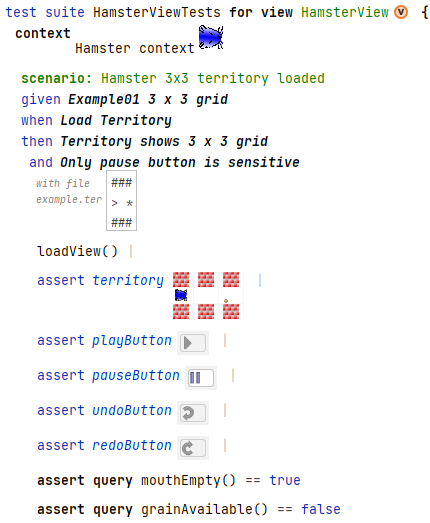
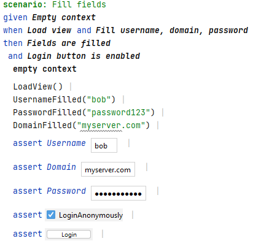
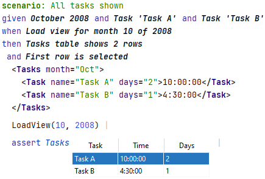

# ViMoTest Prototype - A MPS based prototype for the ViewModel-based Testing approach

In this repository, you can find a prototype where the ViewModel-based Testing (ViMoTest) approach is basically demonstrated.
It is a Model-driven Software Development (MDSD) approach, based on the language workbench JetBrains MPS, which supports the approach with its projectional editors and powerful language modularity features.

The ViMoTest approach is based on three things:

1) BDD-style Testing: Like Behavior-driven Development (BDD), ViMoTest is a testing approach to write test cases in a specification-like structure, by using the _Given_, _When_, _Then_ terms. The goal are tests, which act as executable specifications.
2) ViewModel Pattern: The abstraction layer of the testing approach is focusing on ViewModel datastructures, which represent information to be rendered in a UI. This allows to stay UI-framework independent and enables a good possibility to write (robust, fast) automated tests.
3) Projectional DSLs: As a MDSD approach, this approach makes use of models to allow modeling on a suitable abstraction layer (i.e. UIs, views). To represent elements of the domain `UI` in such models like they are intended (e.g. buttons, tables), MPS provides a good way to develop projectional DSLs.

This prototypical implementation is used as a research artifact, which is also tracked in Zenodo:

## What is ViewModel-based Testing?

ViewModel-based Testing is meant to be an automated testing approach, where (unit) tests are written against a specific abstraction layer, i.e. ViewModels.
ViewModels are an architectural pattern, mainly known from the Microsoft's MVVM (Model-View-ViewModel) pattern.

This approach tries to tackle the problem of fragility in GUI-based tests.
By using ViewModels, a large portion of the View-Logic (presenter, controller code) can be written isolated from concrete GUI frameworks, and enables a good testability.

## Terminology

* **View**: A View is a part of the overall GUI, which is itself composed of GUI widgets.
* **ViewModel**: A ViewModel is a datastructure, which represents information to be rendered in a GUI. It is independent from a concrete GUI framework.
* **GUI Widget**: A GUI widget is a concrete GUI element. Examples are buttons, textfields, tables, etc.
* **View Component**: Synonym for _GUI Widget_ and used internally in the implementation of the prototype.
* **View Event**: A View Event is an event, which is triggered by a GUI widget (when users interact with the GUI). Examples are button clicks, textfield changes, etc.

## Getting Started

* ensure you use Java 20 (required by Gradle 8.2)
* execute `gradlew buildAndOpenProjectInMps` (Windows), `./gradlew buildAndOpenProjectInMps` (MacOS/Linux)
  * this downloads MPS for your current OS and creates an executable installation in `build/mps-bundle`
  * Windows: executes `build/mps-bundle/mps/bin/mps.bat`
  * MacOS: executes `build/mps-bundle/Contents/MacOS/mps`
  * additionally builds the language modules and opens it in MPS
* usually the procedure takes about 2-5 min.
* then, when MPS has opened, the project is ready
* (optionally): switch to light theme in MPS under `Settings`/`Appearance & Behavior`/`Appearance`/`Theme`/`IntelliJ Light`

### Alternative: Build directly in MPS

* when MPS has opened the project and is ready
  * perform menu `Build`/`Make Project`
  * if there are initial build errors, ignore them for now (they shall be resolved after one complete build)

### GitHub Actions

On every commit the language and its samples are built using GitHub actions:

## Samples

### Simple Examples

Inspect the solution `ViewModelLanguage.sandbox`, where you can find a sandbox model.

It contains:

* a sample view `MyView` demonstrating some basic controls like buttons, images, checkboxes or a table
  * the `MyTestSuite` specifies some sample tests for the `MyView`
* a simple login example view `SimpleLoginView`
  * the `SimpleLoginViewTests` specifies sample test cases for the simple login view.

### Subject Applications

The ViMoTest approach is meant to be used with subject applications, which are GUI-based applications.

The following sample applications are modelled:

* Hamster Simulator, a mini programming world to teach programming
* Buddi, a personal finance manager
* UPM, a Universal Password Manager
* Rachota, a task management tool
* Spark, a messaging application

You can also have a look in the `screenshots` directory, where we exported PDF-screenshots of the sample models (Views+Tests).
We did this using the Editor2Pdf MPS plugin (https://github.com/Fumapps/Editor2PDF).

Note: Most of the subject applications are used from the empirical study of Zuddas' research (https://doi.org/10.1145/3236454.3236489).
Also see the readme in `solutions/ExampleApplications/Readme.md`.

### Screenshots

Hamster Simulator Test:

Login View Test:

History Tasks View Test:

Also have a look on PDF-Screenshots of all sample applications in the `screenshots` directory.

## Documentation

See https://vimotest.github.io

## Requirements

See https://github.com/vimotest/vimotest.github.io/blob/main/requirements.md

# Troubleshooting

See https://github.com/vimotest/vimotest.github.io/blob/main/trouble-shooting/trouble-shooting.md
